# Data Structure Overview

> Note: The original source referenced images ("Press enter or click to view image...").
> Those are represented below as placeholders so you can drop screenshots in later.

---

## 1. Array

An **array** is a **contiguous (continuous) block of memory** designed to hold elements (often of the **same data type**, depending on the language). Each item can be accessed directly using its **index**, giving **constant-time lookup** for a known index: **$O(1)$**.


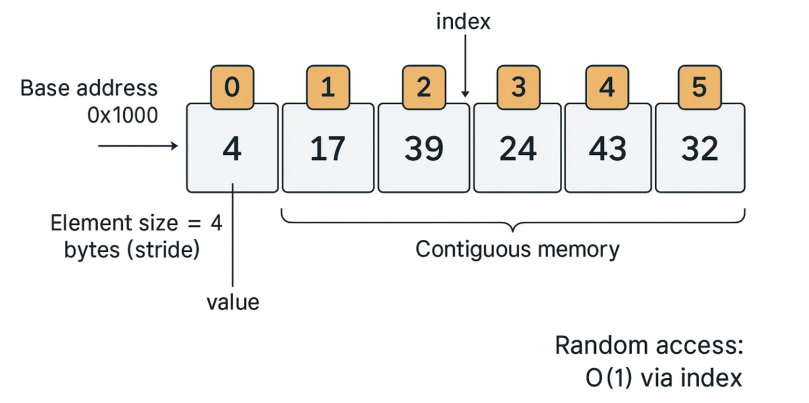

Because elements are stored in sequential memory locations, the address of an element can be computed directly:

$$
	\text{Address} = \text{BaseAddress} + (\text{Index} \times \text{SizeOfElement})
$$

This direct computation explains why random access is $O(1)$ (no traversal is needed).

### When to Use an Array

- When you need instant access by index ($O(1)$).
- When collection size is fixed or changes rarely.
- When you want a simple, efficient structure for sequential data.
- When memory locality matters (contiguous layout is cache-friendly).

### Time & Space Complexities

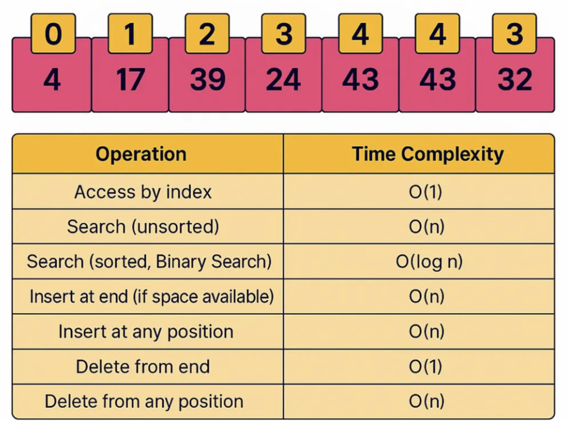

- **Space:** $O(n)$ — memory proportional to the number of elements.

### Other Important Details

1. **Fixed size (in many languages like Java):** once created, an array’s length cannot change.
2. **Resizing overhead:** dynamic alternatives like `ArrayList` may resize by allocating a larger array and copying elements (often doubling capacity).

---

## 2. Matrix

A **matrix** is essentially a **2D array** arranged in **rows and columns**, useful for representing grids, tables, and many mathematical structures.

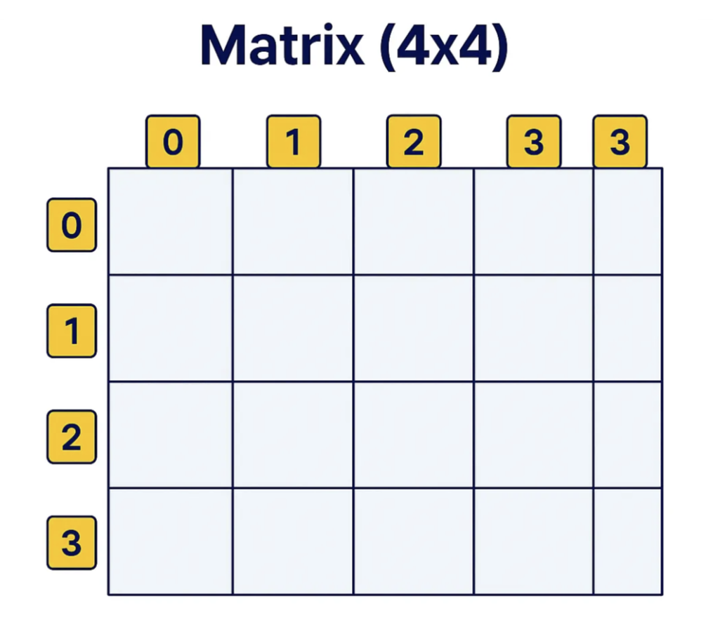

In many languages (including Java), a 2D array is stored in **row-major order**, meaning each row is stored contiguously (conceptually). Access typically looks like:

- `matrix[row][column]`

### When to Use a Matrix

- Grid-based problems (chessboards, Sudoku, word searches).
- Linear algebra / transformations / ML models.
- Graph representation via **adjacency matrix**.
- Image processing (pixels in a 2D grid).
- Dynamic programming tables (e.g., `dp[][]` for LCS, Knapsack).

### Time & Space Complexities

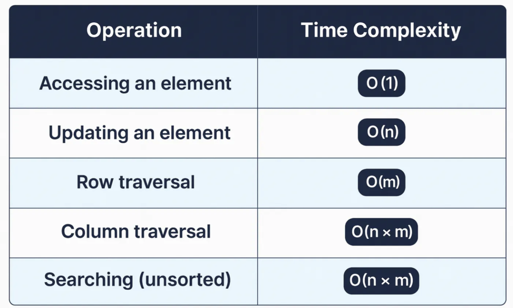

- **Space:** $O(n \times m)$ — stores $n \times m$ elements.

---

## 3. Linked List

A **linked list** is a linear data structure where elements (**nodes**) are connected via **pointers/references** rather than stored in one contiguous memory block.

Each node contains:

- **Data** — the stored value
- **Pointer/Reference (`next`)** — points to the next node

Unlike arrays, linked lists don’t require pre-allocated contiguous memory. They can grow/shrink dynamically, making insertions/deletions (especially near the head) efficient.

### How a Linked List Is Represented

Nodes may be scattered across memory, but they’re logically connected.

Example nodes (Python / Julia / JavaScript):

```python
# Python
class Node:
		def __init__(self, data):
				self.data = data
				self.next = None
```

```julia
# Julia
mutable struct Node
		data::Any
		next::Union{Nothing, Node}
		Node(data) = new(data, nothing)
end
```

```javascript
// JavaScript
class Node {
	constructor(data) {
		this.data = data;
		this.next = null;
	}
}
```

- `data` stores the value
- `next` points to the next node
- the final node has `next = null`

### Types of Linked Lists

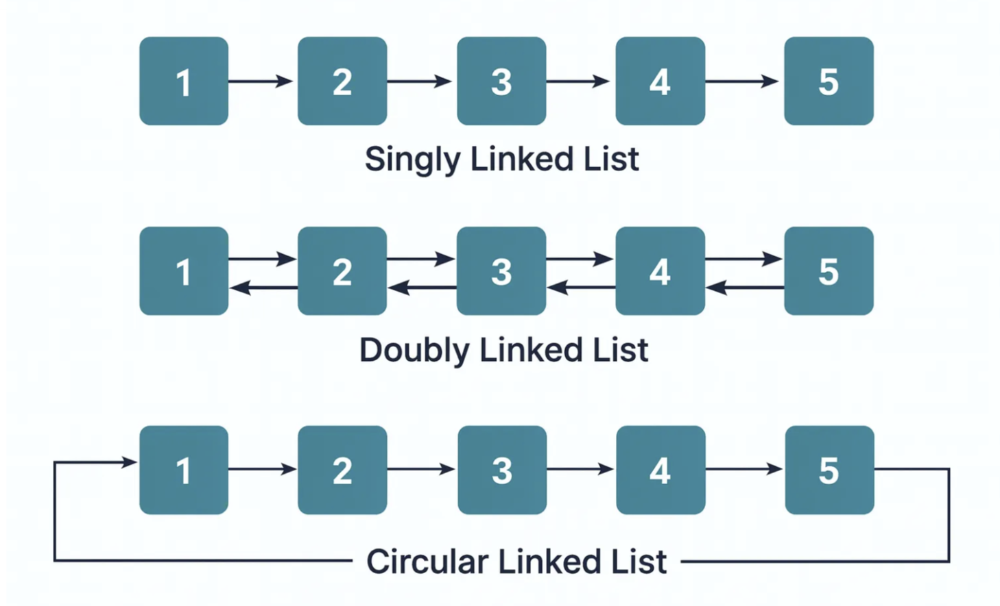

1. **Singly Linked List (SLL):** each node points to the next; traversal is one-direction (head → tail).
2. **Doubly Linked List (DLL):** each node points to next **and** previous; traversal can go both directions.
3. **Circular Linked List (CLL):** tail points back to head, forming a loop (can be singly or doubly circular).

### When to Use a Linked List

- Frequent insertions/deletions (often $O(1)$ when you already have the node/reference).
- When you need dynamic sizing without reallocation.
- When implementing structures like queues/stacks/LRU caches.

### Time & Space Complexities

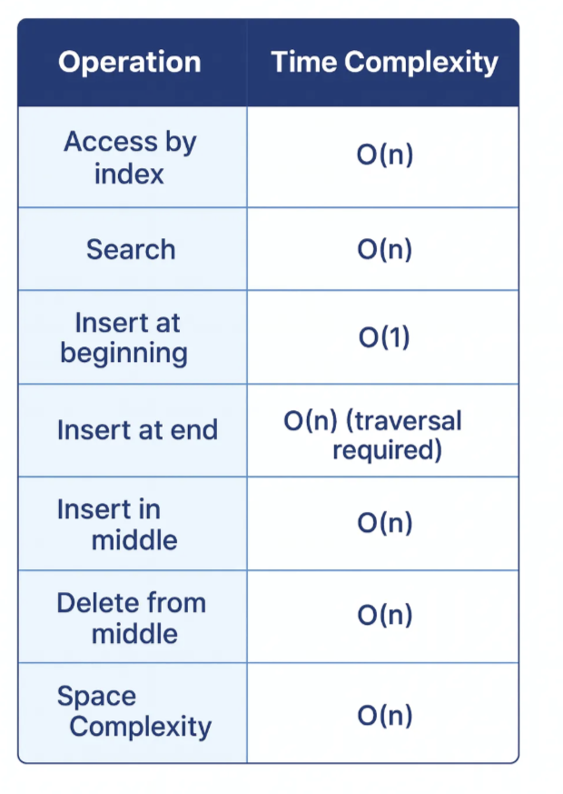

---

## 4. HashMap

A **HashMap** stores **key–value pairs** and uses a **hash function** to map keys to storage locations (buckets). This typically gives **average** $O(1)$ lookup/insert/delete.

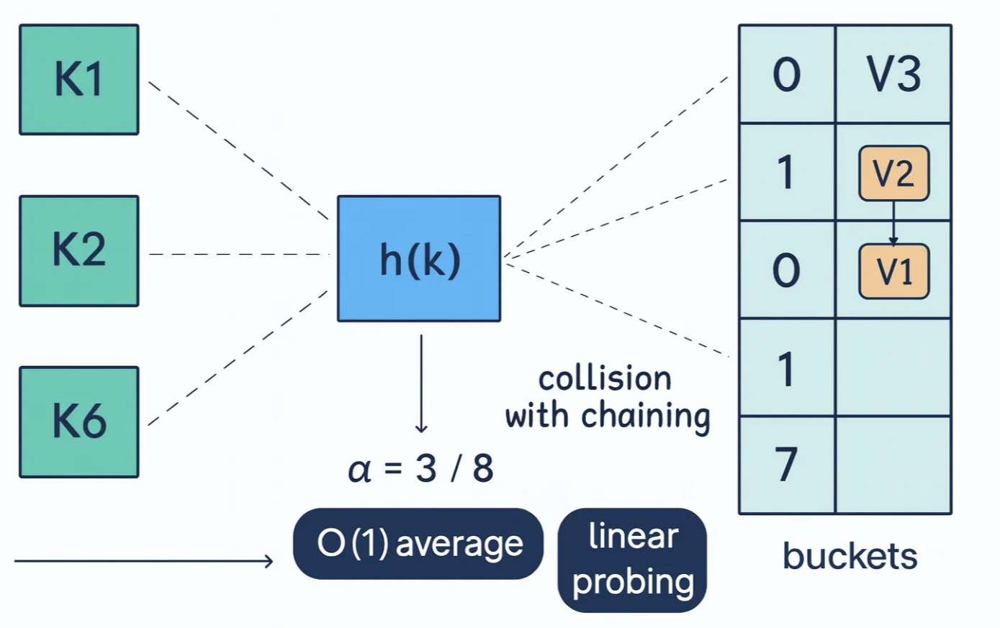

### How a HashMap Is Represented

Under the hood, a HashMap usually maintains an array of **buckets**.

On `put(key, value)`:

1. Compute `hash(key)`.
2. Convert that hash to a bucket index.
3. Insert into that bucket.
4. If there’s a **collision**, store multiple entries in the same bucket.

Collision handling (common strategies):

- **Chaining:** bucket holds a linked list of entries (worst-case bucket lookup $O(n)$).
- **Tree bins:** long chains may convert to a balanced tree (worst-case $O(\log n)$).

Resizing & load factor:

- When `size > capacity × loadFactor` (often `0.75`), the table resizes and **rehashes** entries to maintain average $O(1)$ performance.

Correctness relies on:

- Key types having consistent `hashCode()` and `equals()` behavior (Java).

Tiny sketch (mental model) in Python / Julia / JavaScript:

```python
# Python
class Entry:
		def __init__(self, key, value, hash_value, next=None):
				self.key = key
				self.value = value
				self.hash = hash_value
				self.next = next  # next Entry in the bucket chain


capacity = 8
table = [None] * capacity  # array of buckets
```

```julia
# Julia
mutable struct Entry{K,V}
		key::K
		value::V
		hash::UInt
		next::Union{Nothing, Entry{K,V}}
end


capacity = 8
table = fill(nothing, capacity)  # Vector of buckets (each is `nothing` or an Entry)
```

```javascript
// JavaScript
class Entry {
	constructor(key, value, hashValue, next = null) {
		this.key = key;
		this.value = value;
		this.hash = hashValue;
		this.next = next; // next Entry in the bucket chain
	}
}

const capacity = 8;
const table = new Array(capacity).fill(null); // array of buckets
```

Example mapping idea:

- "Alice" → bucket 1 → [ ("Alice", 28) ]
- "Bob" → bucket 4 → [ ("Bob", 34) ]
- "Eve" → bucket 1 → [ ("Alice", 28), ("Eve", 42) ]  (collision)

### When to Use a HashMap

- Fast key-based lookups (average $O(1)$).
- Frequent insertions/deletions.
- Caches, frequency counters, indexes.
- Mappings between two datasets (e.g., username → userId).

### Time & Space Complexities

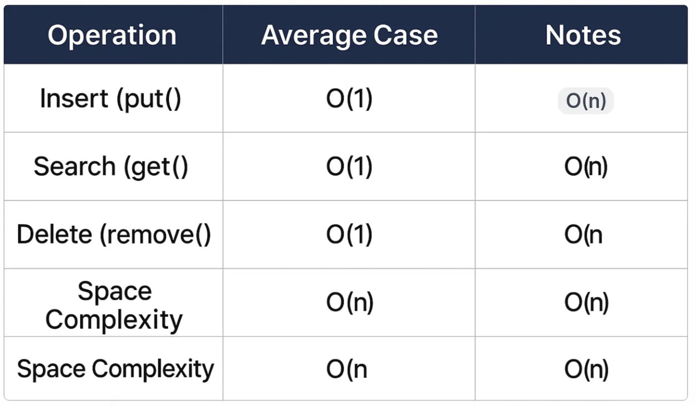

---

## 5. Stack

A **stack** is a linear data structure that follows **Last In, First Out (LIFO)**: the most recently added element is the first removed.

Common operations:

- `push(x)` — add to top
- `pop()` — remove from top
- `peek()` — read top without removing

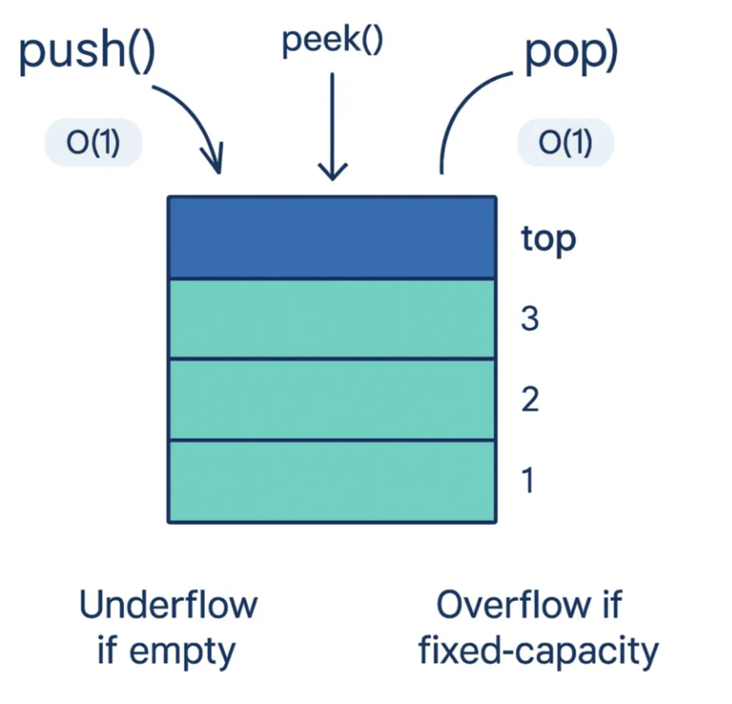

Example sequence:

- `push(4)` → `[4]`
- `push(11)` → `[4, 11]`
- `push(6)` → `[4, 11, 6]`
- `peek()` → `6`
- `pop()` → `[4, 11]`

These operations are typically $O(1)$.

### How a Stack Is Represented

- **Array-based:** cache-friendly, but may be fixed-size (or require resizing).
- **Linked-list-based:** dynamic sizing, but extra memory per node for pointers.

### When to Use a Stack

- LIFO workflows
- Function call stacks / recursion
- Undo/redo systems
- Expression parsing (balanced parentheses, postfix evaluation)

### Time & Space Complexities

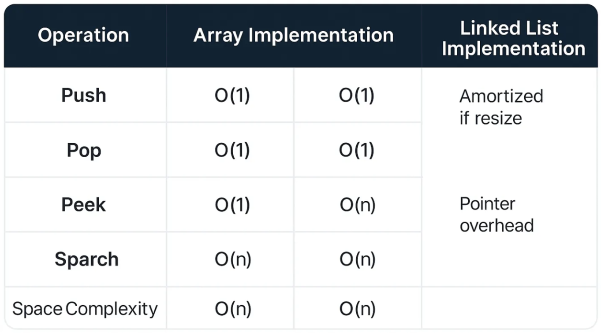

---

## 6. Queue

A **queue** is a linear data structure that follows **First In, First Out (FIFO)**: the earliest added element is the first removed.

Core operations:

- `enqueue(x)` — add to back
- `dequeue()` — remove from front
- `front()` — inspect front
- `isEmpty()` — check if empty


Example sequence:

- `enqueue(7)` → `[7]`
- `enqueue(3)` → `[7, 3]`
- `dequeue()` → `[3]`
- `enqueue(8)` → `[3, 8]`
- `front()` → `3`

These operations are typically $O(1)$ (with a proper implementation).

### How a Queue Is Represented

- **Array/circular buffer:** efficient, but fixed-size unless resized.
- **Linked list:** dynamic, with pointer overhead.

### When to Use a Queue

- FIFO workflows
- Scheduling / buffering / message queues
- Graph BFS
- Real-time request handling

### Time & Space Complexities

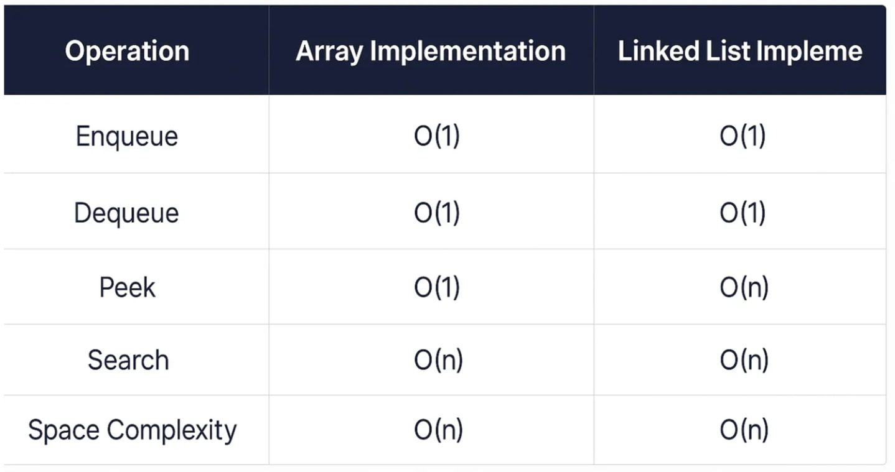

---

## 7. Tree

A **tree** is a **hierarchical** (non-linear) structure of nodes connected by edges, using parent–child relationships.

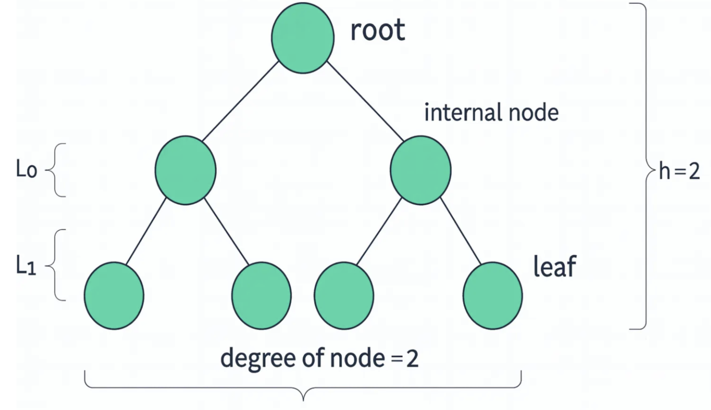

### Tree Basics

- **Root:** topmost node
- **Parent/Child:** a node may have child nodes
- **Leaf:** node with no children
- **Height:** longest path from root to a leaf

A common variant is the **binary tree**, where each node has at most two children (left/right).

### How a Tree Is Represented

Trees are typically built from nodes with references to children.

Example nodes (Python / Julia / JavaScript):

```python
# Python
class Node:
		def __init__(self, data):
				self.data = data
				self.left = None
				self.right = None
```

```julia
# Julia
mutable struct Node
		data::Any
		left::Union{Nothing, Node}
		right::Union{Nothing, Node}
		Node(data) = new(data, nothing, nothing)
end
```

```javascript
// JavaScript
class Node {
	constructor(data) {
		this.data = data;
		this.left = null;
		this.right = null;
	}
}
```

### Tree Traversals

- **Inorder:** Left → Root → Right
- **Preorder:** Root → Left → Right
- **Postorder:** Left → Right → Root
- **Level-order:** breadth-first (uses a queue)

---

## 8. Binary Search Tree (BST)

A **Binary Search Tree (BST)** is a binary tree with the BST ordering rule:

- Left subtree values are **less than** the node’s key
- Right subtree values are **greater than** the node’s key
- Duplicates are typically not allowed (in the standard version)

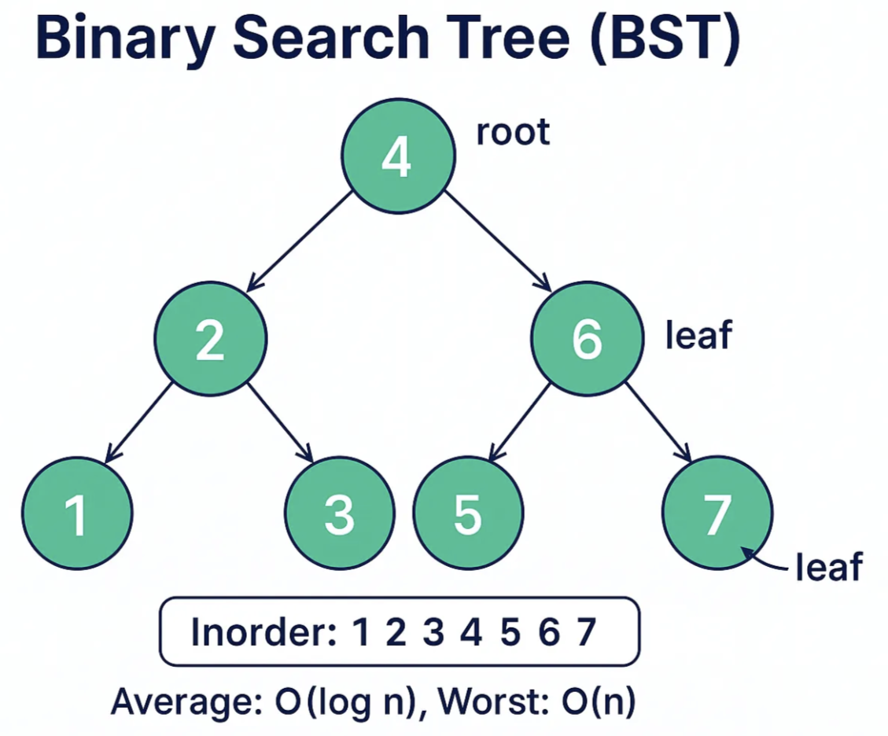

When balanced, search/insert/delete are typically **$O(\log n)$**. If unbalanced, a BST can degrade into a shape similar to a linked list, making operations **$O(n)$**.

Self-balancing BSTs (like **AVL** and **Red–Black trees**) keep the height near $\log_2(n)$.

### When to Use a BST

- Fast search/insert/delete with ordered data (average $O(\log n)$)
- Need sorted traversal (inorder traversal yields sorted order)
- Range queries / ordered dictionaries

### Time & Space Complexities

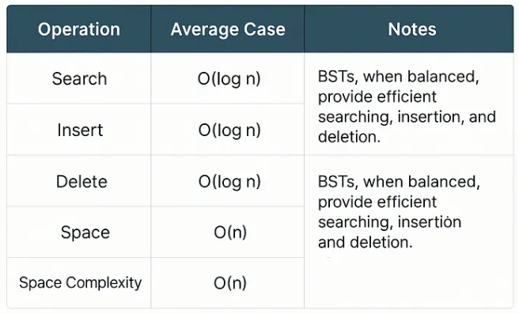

---

## 9. Heaps

A **heap** is a **complete binary tree** that satisfies the heap property:

- **Min-heap:** parent ≤ children
- **Max-heap:** parent ≥ children

Heaps support:

- **Peek top:** $O(1)$
- **Insert:** $O(\log n)$
- **Remove top:** $O(\log n)$

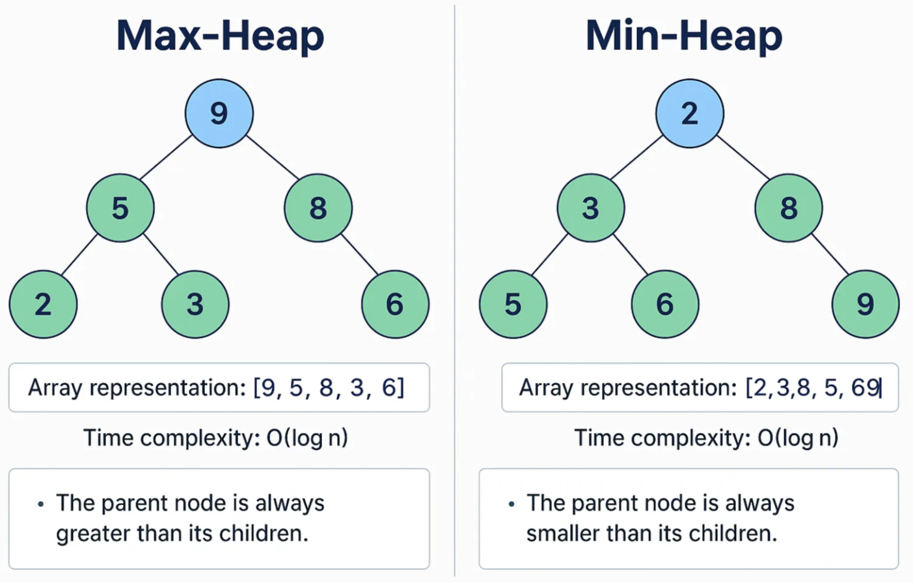

### How a Heap Is Represented

Heaps are usually implemented with an **array**, using index math:

- Left child: `2*i + 1`
- Right child: `2*i + 2`
- Parent: `(i - 1) / 2`

### When to Use a Heap

- Priority queues / scheduling
- Top-K problems, median maintenance
- Heap sort
- Graph algorithms like Dijkstra / Prim

### Time & Space Complexities

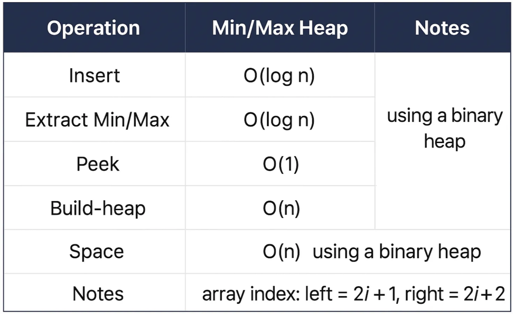

---

## 10. Trie 

A **Trie** (prefix tree) stores strings by their prefixes. Each node typically represents a **character**, and a path from the root forms a word.

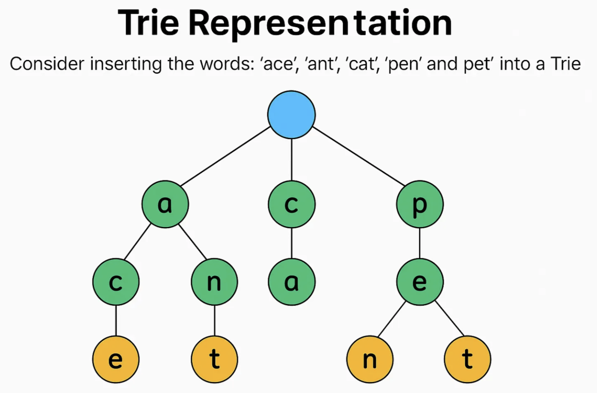

Key benefit: prefix search in **$O(L)$**, where $L$ is the length of the word/prefix.

### How a Trie Is Represented

Nodes usually contain:

- `children`: map/array to next characters
- `isEndOfWord`: boolean flag

Conceptual sketch (Python / Julia / JavaScript):

```python
# Python
class TrieNode:
		def __init__(self):
				self.children = {}          # dict: char -> TrieNode
				self.is_end_of_word = False
```

```julia
# Julia
mutable struct TrieNode
		children::Dict{Char, TrieNode}
		is_end_of_word::Bool
		TrieNode() = new(Dict{Char, TrieNode}(), false)
end
```

```javascript
// JavaScript
class TrieNode {
	constructor() {
		this.children = new Map(); // char -> TrieNode
		this.isEndOfWord = false;
	}
}
```

### When to Use a Trie

- Autocomplete / search suggestions
- Spell check / dictionary lookup
- Prefix matching (e.g., IP routing)
- Large string datasets where shared prefixes save space

### Time & Space Complexities

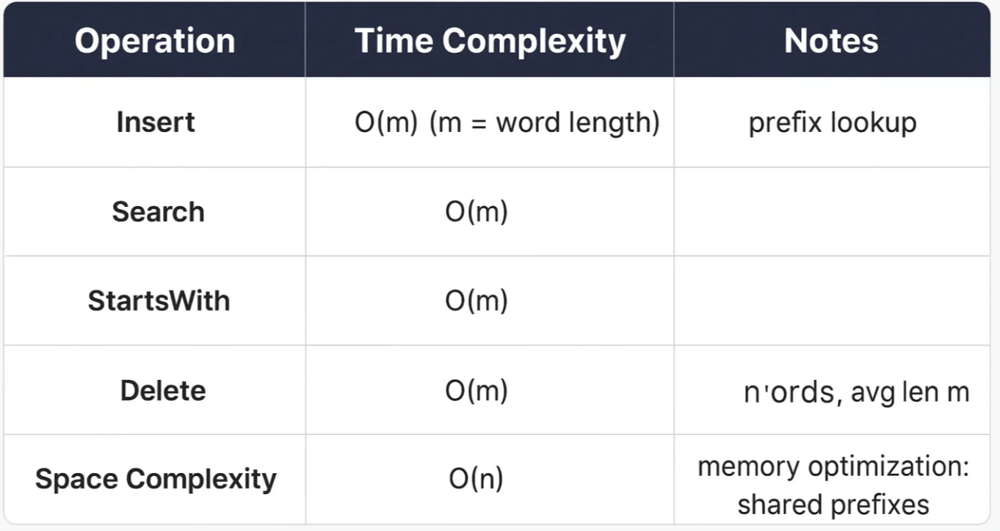

---

## 11. Graph

A **graph** models relationships using:

- **Vertices (nodes)**
- **Edges (links)**

Graphs may be directed/undirected and weighted/unweighted.

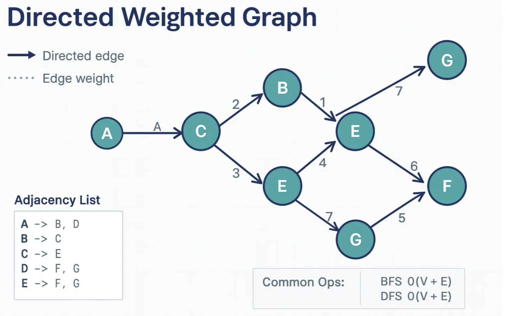

### Types of Graphs

- **Directed graph:** edges have direction (u → v)
- **Undirected graph:** edges are bidirectional (u — v)
- **Weighted graph:** edges have weights/costs
- **Unweighted graph:** edges treated as equal cost
- **DAG:** directed acyclic graph (supports topological ordering)

Tip: BFS/DFS traversals are $O(V + E)$.

### Graph Representations

#### 1) Adjacency Matrix

A 2D array where `graph[i][j]` indicates an edge (or weight).

Example adjacency-matrix sketches (Python / Julia / JavaScript):

```python
# Python
class GraphMatrix:
		def __init__(self, size: int):
				self.size = size
				self.adj = [[0] * size for _ in range(size)]

		def add_edge(self, u: int, v: int):
				self.adj[u][v] = 1
				self.adj[v][u] = 1  # undirected

		def is_connected(self, u: int, v: int) -> bool:
				return self.adj[u][v] == 1
```

```julia
# Julia
mutable struct GraphMatrix
		adj::Matrix{Int}
end

GraphMatrix(n::Int) = GraphMatrix(zeros(Int, n, n))

function add_edge!(g::GraphMatrix, u::Int, v::Int)
		g.adj[u, v] = 1
		g.adj[v, u] = 1  # undirected
end

is_connected(g::GraphMatrix, u::Int, v::Int) = g.adj[u, v] == 1
```

```javascript
// JavaScript
class GraphMatrix {
	constructor(size) {
		this.size = size;
		this.adj = Array.from({ length: size }, () => Array(size).fill(0));
	}

	addEdge(u, v) {
		this.adj[u][v] = 1;
		this.adj[v][u] = 1; // undirected
	}

	isConnected(u, v) {
		return this.adj[u][v] === 1;
	}
}
```

- Edge check: $O(1)$
- Space: $O(V^2)$ (bad for sparse graphs)

#### 2) Adjacency List

For each vertex, store a list of its neighbors.

```java
import java.util.*;

public class GraphList {
	private final Map<Integer, List<Integer>> adjList = new HashMap<>();

	public void addEdge(int u, int v) {
		adjList.computeIfAbsent(u, k -> new ArrayList<>()).add(v);
		adjList.computeIfAbsent(v, k -> new ArrayList<>()).add(u); // undirected
	}

	public List<Integer> getNeighbors(int node) {
		return adjList.getOrDefault(node, Collections.emptyList());
	}
}
```

- Space: $O(V + E)$ (great for sparse graphs)
- Edge lookup: $O(\deg(v))$ (slower than matrix for direct edge checks)

---

## 12. Union–Find (Disjoint Set Union, DSU)

**Union–Find** tracks a collection of **disjoint sets** and supports:

- `find(x)` — returns the representative (root) of x’s set
- `union(x, y)` — merges the sets containing x and y

### Optimizations

- **Path compression:** flattens trees during `find` to speed up future operations
- **Union by rank/size:** attach smaller tree under larger tree

### Complexity

With both optimizations, amortized time per operation is $\alpha(n)$ (inverse Ackermann), effectively constant in practice.

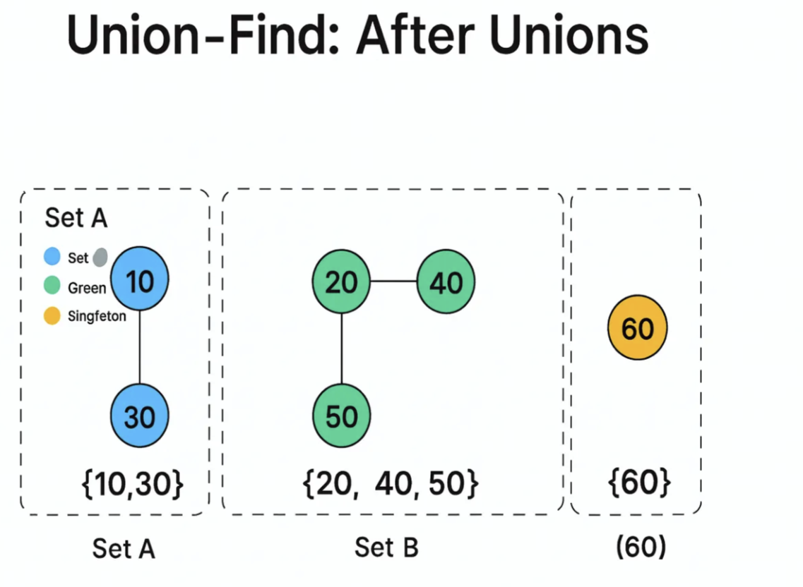

### How Union–Find Is Implemented

- `parent[]`: parent pointer array (root has `parent[i] = i`)
- `rank[]` (or `size[]`): helps keep trees shallow

```java
class UnionFind {
	int[] parent, rank;

	UnionFind(int n) {
		parent = new int[n];
		rank   = new int[n];
		for (int i = 0; i < n; i++) { parent[i] = i; rank[i] = 1; }
	}

	int find(int x) {
		return parent[x] == x ? x : (parent[x] = find(parent[x]));
	}

	void union(int a, int b) {
		a = find(a);
		b = find(b);
		if (a == b) return;
		if (rank[a] < rank[b]) { int t = a; a = b; b = t; }
		parent[b] = a;
		if (rank[a] == rank[b]) rank[a]++;
	}

	boolean connected(int a, int b) {
		return find(a) == find(b);
	}
}
```

### When to Use Union–Find

- Connected components queries
- Cycle detection in undirected graphs
- Dynamic connectivity
- Kruskal’s MST algorithm

### Time & Space Complexities

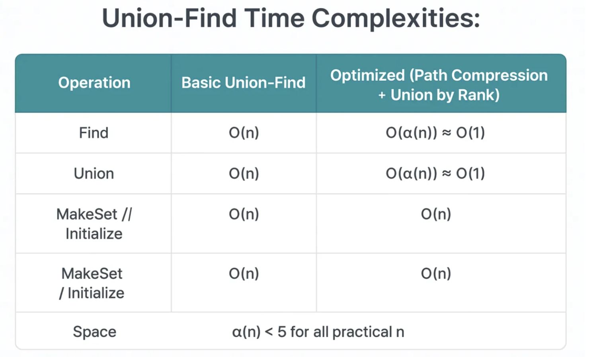

