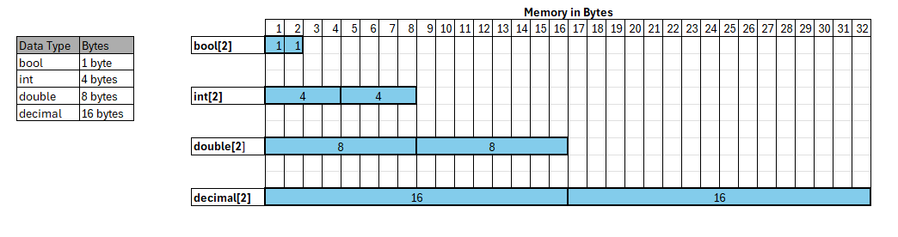

# Array Data Structure

- An array is a fundamental and linear data structure that can be used to build other data structures like Stack Queue, Deque, Graph, Hash Table, etc.

- Arrays are static types, which means you cannot change the length of the array once it has been defined.

- You must specify the array length when defining the array.

- An array is a homogeneous data structure, so it can only contain elements of the same type.  

- Arrays are indexed.  First element is located at Index 0.

- Array elements have direct random-access, by way of index, making arrays highly performant.

- Arrays are allocated using contiguous space.  For instance, if an eight-element array of doubles was declared, then the system would have to find 64 consecutive bytes of free memory (8 elements of 8 bytes = 64 bytes).  

Below is an example of multiple arrays.  All have length of two, but they have different data types.

The memory address for the first element, Index 0, is also the base memory address for the array.

In order to find the other elements of the array you simply add (Index * Data Type Size) to the base address.

Example: If the base address for an array of doubles was 1000.  

1. The base address for array is 1000
1. The memory address for Index 0 is also 1000
1. The memory address for Index 1 is 1000 + (Index * double data type size)  
1. Index 1 is located at 1000 + (1 * 8) = 1008
1. Index 2 is located at 1000 + (2 * 8) = 1016
1. Index n is located at 1000 + (n * 8)

In general, primitive data type values are stored directly in the array elements.  An array of objects will contain the memory address of the object in the heap.  

For dynamic typed languages like Python, memory address of item in heap is stored for both primitive data types and objects.  Everything is an object in Python.